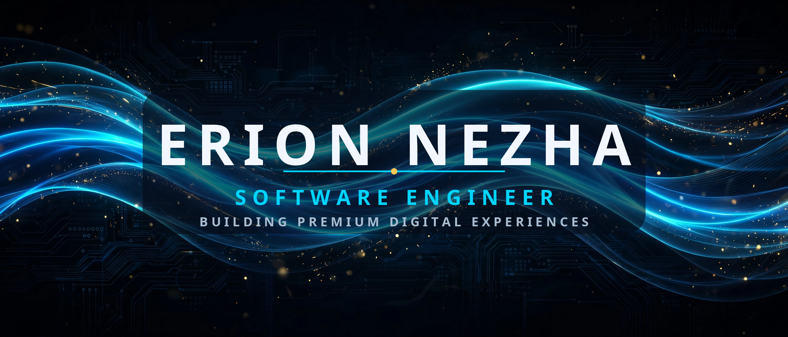

  

  

  

 

## ⚡ About Me

- 🔭 I build **mobile apps**, **web platforms** and **brand identities** — from idea to launch
- 🌱 Currently exploring **AI-powered products** and premium digital experiences
- 💬 Ask me about **Kotlin, Java, JavaScript, Python** and mobile development
- 📫 Reach me at **erjonixx@proton.me**
- 🌍 Based in **Albania** — working with clients worldwide
- ⚡ Fun fact: I treat every pixel and every line of code like it matters

 

## 🛠️ Tech Stack

**Languages**
 

**Frameworks & Platforms**
 

**Tools & Design**
 

 

## 📊 GitHub Stats

 

 

## 🐍 Watch my contributions get eaten

  <picture>
    <source media="(prefers-color-scheme: dark)" srcset="https://raw.githubusercontent.com/erionnezha/erionnezha/output/github-contribution-grid-snake-dark.svg" />
    <source media="(prefers-color-scheme: light)" srcset="https://raw.githubusercontent.com/erionnezha/erionnezha/output/github-contribution-grid-snake.svg" />
    
  </picture>

 

## 🤝 Connect with me

 

  

